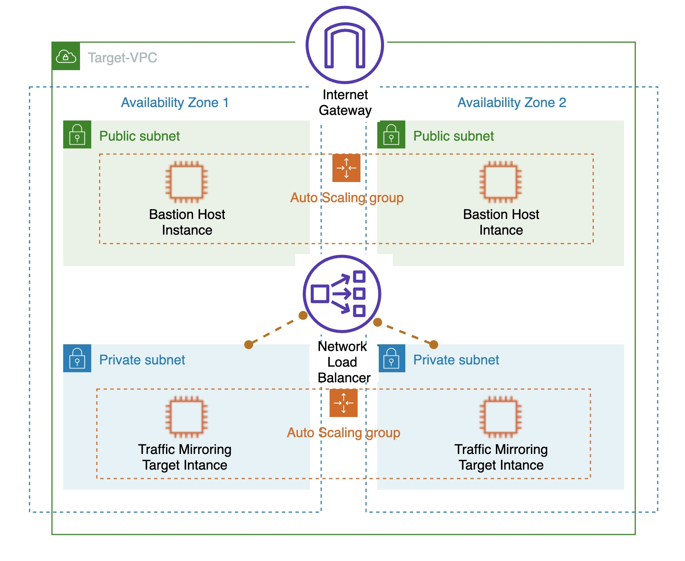

:xrefstyle: short

Deploying this Quick Start for a new virtual private cloud (VPC) with
default parameters builds the following {partner-product-short-name} environment in the
AWS Cloud.

// Replace this example diagram with your own. Follow our wiki guidelines: https://w.amazon.com/bin/view/AWS_Quick_Starts/Process_for_PSAs/#HPrepareyourarchitecturediagram. Upload your source PowerPoint file to the GitHub {deployment name}/docs/images/ directory in this repo. 

[#architecture1]
.Quick Start architecture for {partner-product-short-name} on AWS

As shown in <<architecture1>>, the Quick Start sets up the following:

* A highly available architecture that spans two Availability Zones (AZ)
* A VPC configured with public and private subnets as per the AWS best practices.
* An Internet gateway (IGW) to allow access to Internet.
* Network address translation gateway (NAT GW) in each AZ to allow outbound Internet access for 
resources in private subnets. This allows instances in private subnet to install packages like
Suricata from the Internet.
* A Linux bastion host in each public subnet with an Elastic IP address to allow inbound SSH (Secure Shell) 
access to Amazon EC2 instances in public and private subnets.
* Amazon Linux 2 (AL2) EC2 instance with Suricata software installed on it in a private subnet.
* Amazon EC2 Auto Scaling group for Linux bastion host and AL2 EC2 instances. Number of instances are configurable.
* If TrafficMirrorTargetType=NLB, creates Network Load Balancer (NLB) to distribute traffic to AL2 EC2 instances.
* Security groups for Linux bastion host and AL2 EC2 instance to control inbound and outbound traffic.
* A set of Elastic IP (EIP) addresses to match the number of bastion hosts and NAT GWs.
* An IAM role and profile that allows access to AWS Systems Manager from AL2 EC2 instances
* An Amazon CloudWatch Logs group for the Linux bastion host shell history logs.

[.small]#*You can launch just the [vpc-traffic-mirroring-target](../../templates/vpc-traffic-mirroring-target.template) template to either create NLB + AL2 EC2 instances or just AL2 EC2 instances in an existing VPC.

[.small]#*The Quick Start does not configure VPC Traffic Mirroring to monitor your network traffic. Refer to [Traffic Mirroring getting start guide](https://docs.aws.amazon.com/vpc/latest/mirroring/traffic-mirroring-getting-started.html) for configuring VPC Traffic Mirroring.
