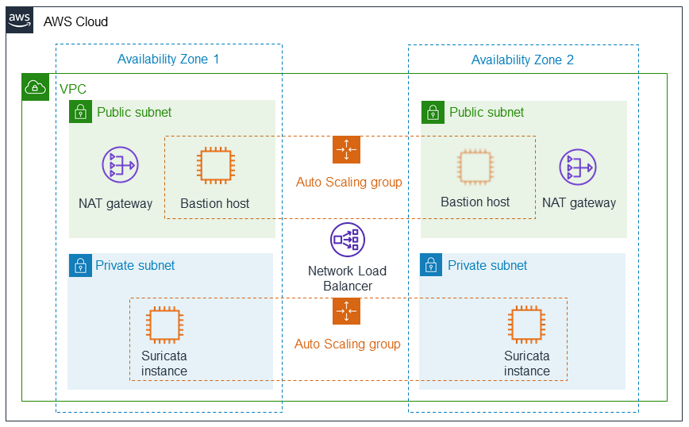

:xrefstyle: short

Deploying this Quick Start for a new virtual private cloud (VPC) with
default parameters builds the following {partner-product-short-name} environment in the
AWS Cloud.

// Replace this example diagram with your own. Follow our wiki guidelines: https://w.amazon.com/bin/view/AWS_Quick_Starts/Process_for_PSAs/#HPrepareyourarchitecturediagram. Upload your source PowerPoint file to the GitHub {deployment name}/docs/images/ directory in this repo. 

[#architecture1]
.Quick Start architecture for {partner-product-short-name} on AWS

As shown in <<architecture1>>, the Quick Start sets up the following:

* A highly available architecture that spans multiple Availability Zones.*
* A VPC configured with public and private subnets according to AWS best practices, to provide you with your own virtual network on AWS.*
* In the public subnets:
 ** Managed network address translation (NAT) gateways to allow outbound internet access for resources in the private subnets.*
 ** A Linux bastion host in an Auto Scaling group to allow inbound Secure Shell (SSH) access to EC2 instances in public and private subnets.*
* In the private subnets:
 ** EC2 instances in an Auto Scaling group used for deploying across two Availability Zones, offering high availability.
 ** A Network Load Balancer to balance traffic between the EC2 instances. For limited scale deployments, you can skip the Network Load Balancer setup and work directly with Suricata deployed on a single Amazon Linux 2 instance by choosing `TrafficMirrorTargetType` as `ENI` and `NumTargetEC2Instances` as `1`. See link:#_parameter_reference[Parameter reference] section for details.

*The template that deploys the Quick Start into an existing VPC skips the components marked by asterisks and prompts you for your existing VPC configuration.

NOTE: This Quick Start does not configure VPC Traffic Mirroring. For information about configuring Traffic Mirroring to monitor your network traffic, see the  
https://docs.aws.amazon.com/vpc/latest/mirroring/traffic-mirroring-getting-started.html[Traffic Mirroring getting start guide^].
