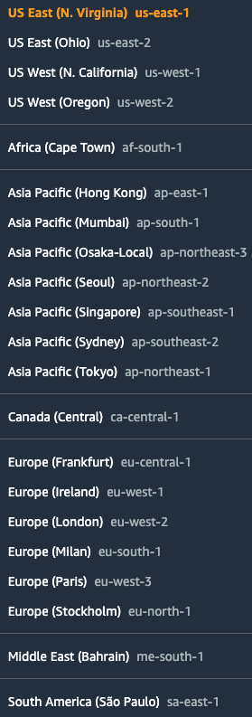
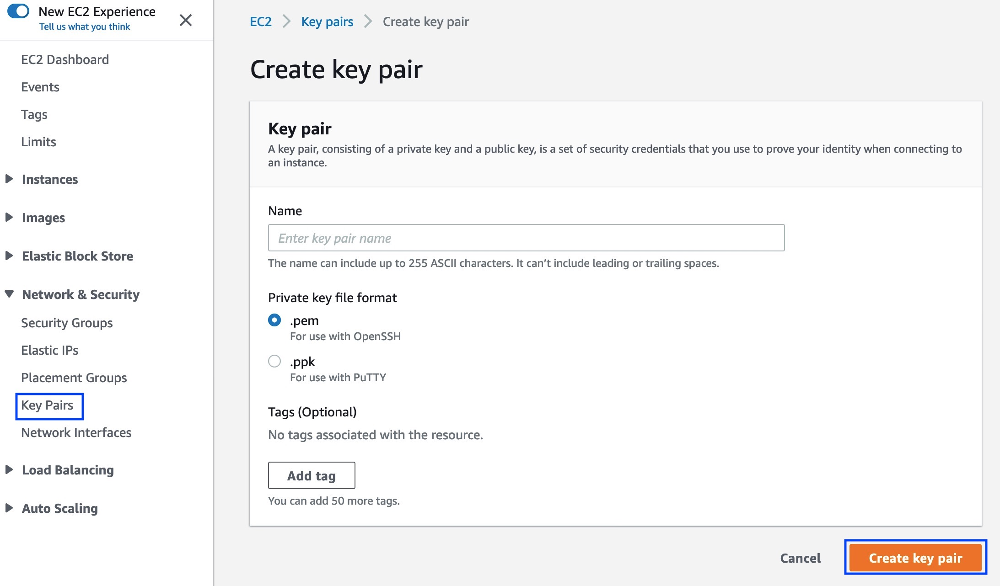

// If no preperation is required, remove all content from here

==== Prepare your AWS account

==== Choose an AWS Region

* Before deploying the stack, in the AWS Management Console, choose an AWS Region from the top toolbar.
+
:xrefstyle: short
[#region]
.Selecting an AWS Region

+
NOTE: Consider choosing a Region where you want monitor Amazon EC2 intance network traffic using 
VPC Traffic Mirroring.

_Describe any setup required in the partner portal/account prior to template launch_

==== Create a key pair

To create a http://docs.aws.amazon.com/AWSEC2/latest/UserGuide/ec2-key-pairs.html[key pair] in your preferred Region, do the following:

[start=1]
. In your AWS Management Console, choose an AWS Region.
. On the *Services* menu, choose *EC2*.
. Under *Network and Security*, choose *Key Pairs*.
. Choose *Create Key Pair*.
. Enter a name and choose *Create*.
+
:xrefstyle: short
[#keypair]
.Creating a key pair

+

Amazon EC2 uses public-key cryptography to encrypt and decrypt login information. To
be able to log in to your instances, you must create a key pair. On Linux, the key pair is
used to authenticate SSH login.

==== Amazon Linux 2 EC2 instance type

Suricata is an open source Network Intrusion Detection System (IDS), Intrusion Prevention System (IPS) 
and Network Security Monitoring (NSM) engine. 

You might want to use single target for multiple sources. In doing so target can become resource constrained. 
You need to benchmark your performance to appropriately select and size your EC2 instance running Suricata.

You can also horizontally scale EC2 instances running Suricata by front ending them with a network load balancer (NLB) 
and use NLB as a target instead. 

==== Suricata

You should be familiar with [Suricata](https://suricata.io/)